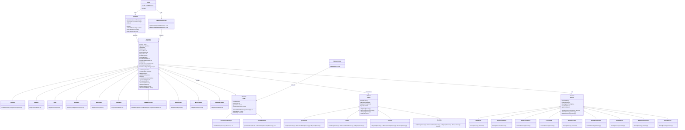

## Diagrama de Clases

```mermaid
classDiagram
    direction TB

    class Personaje {
        <<abstract>>
        #nombre String
        #tipoClase TipoClase
        #vidaMax int
        #vidaActual int
        #recursoMax int
        #recursoActual int
        #ataqueBase int
        #poderMagico int
        #defensaBase int
        #barraAturdimiento int
        #maxBarraAturdimiento int
        #arma Arma
        #estadosActivos List~Estado~
        #hechizos List~Hechizo~
        #cooldowns Map~String,Integer~
        +estaVivo() boolean
        +estaAturdido() boolean
        +recibirDanio(int)
        +recibirDanioPuro(int)
        +curar(int)
        +gastarRecurso(int) boolean
        +aplicarEstado(Estado)
        +procesarEstados()
        +atacarCon(Personaje)
        +reducirCooldowns()
        +elegirAccionIA(List, List)*
        +resumenCombate() String
    }

    class Guerrero { +recibirDanio(int) +elegirAccionIA(List,List) }
    class Duelista { +elegirAccionIA(List,List) }
    class Mago { +elegirAccionIA(List,List) }
    class Sacerdote { +curar(int) +elegirAccionIA(List,List) }
    class Explorador { +elegirAccionIA(List,List) }
    class Ilusionista { +elegirAccionIA(List,List) }
    class CaballeroOscuro { -contadorGolpes int +recibirDanio(int) +elegirAccionIA(List,List) }
    class MagoOscuro { +elegirAccionIA(List,List) }
    class BrutoPintado { +elegirAccionIA(List,List) }
    class GuardianPintado { +elegirAccionIA(List,List) }

    Personaje <|-- Guerrero
    Personaje <|-- Duelista
    Personaje <|-- Mago
    Personaje <|-- Sacerdote
    Personaje <|-- Explorador
    Personaje <|-- Ilusionista
    Personaje <|-- CaballeroOscuro
    Personaje <|-- MagoOscuro
    Personaje <|-- BrutoPintado
    Personaje <|-- GuardianPintado

    class Arma {
        <<abstract>>
        #nombre String
        #danioBase int
        #probCritico double
        #multiplicadorCritico double
        +calcularDanio(Personaje,Personaje)* int
        +descripcion() String
        #esCritico() boolean
    }
    class ArmaCuerpoACuerpo { +calcularDanio(Personaje,Personaje) int }
    class ArmaADistancia { -ignorarDefensa double +calcularDanio(Personaje,Personaje) int }

    Arma <|-- ArmaCuerpoACuerpo
    Arma <|-- ArmaADistancia
    Personaje --> Arma : equipa

    class Estado {
        <<abstract>>
        #nombre String
        #turnosRestantes int
        #potenciaPorTurno int
        #tipo TipoEstado
        +alAplicar(Personaje)*
        +alProcesarTurno(Personaje)*
        +alExpirar(Personaje)*
        +reducirDuracion()
    }
    class Quemadura { +alAplicar(Personaje) +alProcesarTurno(Personaje) +alExpirar(Personaje) }
    class Veneno { +alAplicar(Personaje) +alProcesarTurno(Personaje) +alExpirar(Personaje) }
    class Renovar { +alAplicar(Personaje) +alProcesarTurno(Personaje) +alExpirar(Personaje) }
    class Aturdido { +alAplicar(Personaje) +alProcesarTurno(Personaje) +alExpirar(Personaje) +bloqueaAccion() boolean }

    Estado <|-- Quemadura
    Estado <|-- Veneno
    Estado <|-- Renovar
    Estado <|-- Aturdido
    Personaje --> Estado : tiene activos

    class Hechizo {
        <<abstract>>
        #nombre String
        #costeRecurso int
        #tipoObjetivo TipoObjetivo
        #cooldownMax int
        #potenciaBase int
        +puedeLanzarse(Personaje) boolean
        +lanzar(Personaje,Personaje)*
        #aplicarCooldown(Personaje)
    }
    class LlamaPicta { +lanzar(Personaje,Personaje) }
    class ImpactoCalcinante { +lanzar(Personaje,Personaje) }
    class SombraCromatica { +lanzar(Personaje,Personaje) }
    class LuzCelestial { +lanzar(Personaje,Personaje) }
    class BrilloRenovador { +lanzar(Personaje,Personaje) }
    class FlechaEnvenenada { +lanzar(Personaje,Personaje) }
    class VeloDeIlusion { +lanzar(Personaje,Personaje) }
    class MaldicionDeLaPintora { +lanzar(Personaje,Personaje) }
    class OleadaOscura { +lanzar(Personaje,Personaje) }

    Hechizo <|-- LlamaPicta
    Hechizo <|-- ImpactoCalcinante
    Hechizo <|-- SombraCromatica
    Hechizo <|-- LuzCelestial
    Hechizo <|-- BrilloRenovador
    Hechizo <|-- FlechaEnvenenada
    Hechizo <|-- VeloDeIlusion
    Hechizo <|-- MaldicionDeLaPintora
    Hechizo <|-- OleadaOscura
    Personaje --> Hechizo : usa

    class Combate {
        -equipoHeroes List~Personaje~
        -equipoVillanos List~Personaje~
        -ronda int
        +iniciar()
        -combateTerminado() boolean
        -mostrarEstadoCombate()
        -mostrarResumenFinal()
    }
    class Juego {
        -TOTAL_COMBATES int
        +iniciar()
    }
    class CatalogoPersonajes {
        +generarEquipoHeroesRandom() List
        +generarEquipoVillanosRandom() List
    }
    class CatalogoArmas {
        +getArma(int) Arma
    }

    Juego --> Combate : crea
    Juego --> CatalogoPersonajes : usa
    Combate --> Personaje : gestiona
    CatalogoPersonajes --> Personaje : instancia
    CatalogoArmas --> Arma : instancia
```

---

